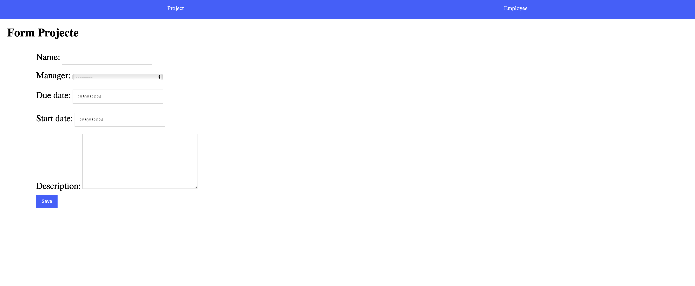
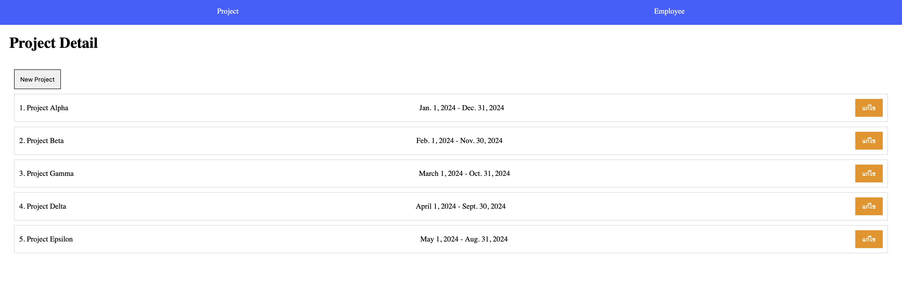
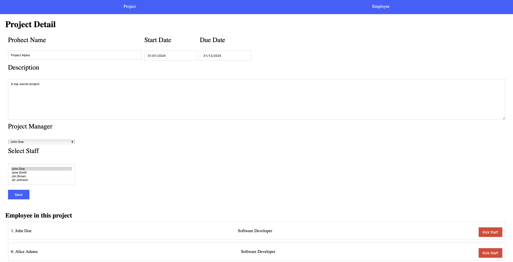

# WEEK 10 EXCERCISE

- จะต้องใช้แบบฝึกหัดใน WEEK 9 ในการทำแบบฝึกหัดครังนี้ต่อครับ
- ไฟล์ template ที่เกี่ยวข้อง

    ```text
    templates/
        - project_detail.html
        - project_form.html
        - project.html
    ```

## Part 1: Employee Model Form

1.1 ทำการเปลี่ยน class `EmployeeForm(forms.Form)` มาเป็น `ModelForm` และแก้ไขใน view ให้สามารถบันทึกข้อมูล emaployee ได้เหมือนเดิม (0.5 คะแนน)

1.2 เพิ่มการ validate ข้อมูลใน field `hire_date` ว่าจะต้องไม่เป็นวันในอนาคต (0.5 คะแนน)

**Hint:** ให้ทำการ validate โดยการ clean ใน class form

## Part 2: Project Model Form

2.1 กำหนด path ให้กดปุ่ม New Project ไปยังหน้า form สำหรับเพิ่มข้อมูล Project `project_form.html` แสดงหน้า form ให้ถูกต้องดังภาพ (1 คะแนน)

**Hint:** ให้สร้าง `ModelForm` สำหรับ form สร้าง project และทำการ validate ว่า start_date จะต้องเป็นวันก่อน due_date



2.2 บันทึกข้อมูลโปรเจคใหม่ หลังจากยันทึกสำเร็จให้ redirect กลับไปที่หน้า project list (0.5 คะแนน)

 

2.3 เมื่อกดปุ่มแก้ไขที่หน้า project list ให้ไปยังหน้า project detail และแสดงผล Form สำหรับแก้ไขข้อมูลโปรเจคดังภาพ (0.5 คะแนน)

**Hint:** ให้สร้าง view ใหม่สำหรับใช้ update ข้อมูล project ตัวอย่างการใช้ form ในการ update ข้อมูลดังด้านล่าง

```python
from django.http import HttpResponse
from django.views import View

class UpdateArticleView(View):

    def post(self, request, article_id):
    article = Article.objects.get(pk=article_id)
    # for updating article instance set instance=article
    form = ArticleForm(request.POST, instance=article)

    # save if valid                                       
    if form.is_valid():                                                                      
        form.save()                                                                          
        return HttpResponse("saved")

    return HttpResponse("error")
```



2.4 เมื่อกดปุ่ม Save ให้ทำการแก้ไขข้อมูล project และสามารถเพิ่มพนักงานเข้ามาใน Project ได้ หลังจากแก้ไขให้ redirect กลับมาหน้าเดิมพร้อมแสดงข้อมูลที่ถูกแก้ไขแล้ว (1 คะแนน)

**Hint:** ปุ่ม "kick staff" ไม่ต้องทำนะครับ เอาแค่ให้เพิ่ง staff ได้เมื่อกด Save พอครับ หรือถ้าใครอยากลองทำก็ได้ครับ