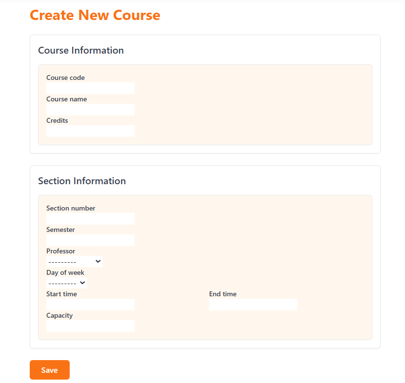
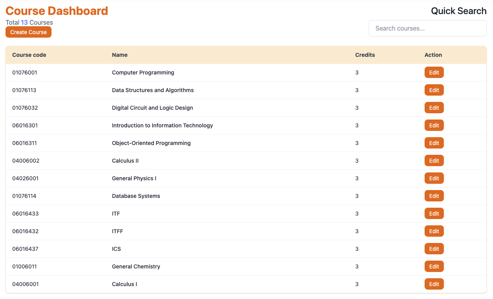
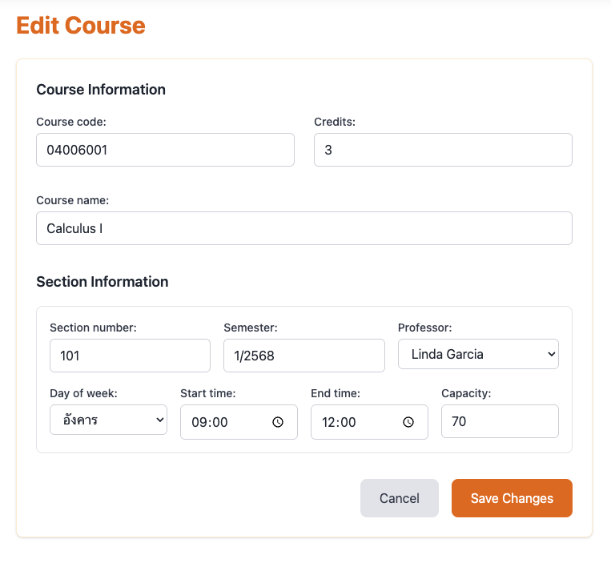
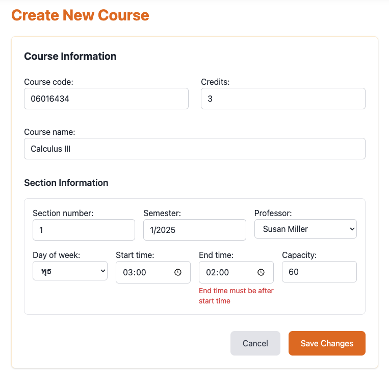

# WEEK 10 EXCERCISE

- จะต้องใช้แบบฝึกหัดใน WEEK 9 ในการทำแบบฝึกหัดครังนี้ต่อครับ

- ไฟล์ template ที่เกี่ยวข้อง

```text
templates/
- base.hmtl
- course.hmtl
- create_course.html
- create_student.html
- faculty.html
- index.html
- nav.html
- professor.html
- update_student.html
```

## Part 1: Student Model Form

1.1 ทำการเปลี่ยน class `StudentForm(forms.Form)` มาเป็น `ModelForm` และแก้ไขใน view ให้สามารถบันทึกข้อมูล emaployee ได้เหมือนเดิม (0.5 คะแนน)

1.2 เพิ่มการ validate ข้อมูลใน field `email` ว่าจะต้องลงท้ายด้วย @kmitl.ac.th (0.5 คะแนน)

**Hint:** ให้ทำการ validate โดยการ clean ใน class Form

## Part 2: Course Model Form

2.1 กำหนด path ให้กดปุ่ม Create Course ไปยังหน้า form สำหรับเพิ่มข้อมูล course `create_course.html` แสดงหน้า form ให้ถูกต้องดังภาพ

**Hint:** ให้สร้าง `ModelForm` สำหรับ form สร้าง course และ section



และทำการ implement `View` สำหรับบันทึกการสร้างข้อมูล Course ใหม่ให้สมบูรณ์ โดยหลังจากยันทึกสำเร็จให้ redirect กลับไปที่หน้า Course Dashboard (0.5 คะแนน)

2.2 ในหน้า Course Dashboard ในตารางข้อมูล ให้เพิ่ม Column ใหม่ชื่อว่า "Action" โดย Column นี้จะเป็นปุ่ม Edit ที่กดไปแล้วจะเป็นหน้า form แก้ไขรายละเอียด และให้ Implement การแก้ไขข้อมูล Course ให้สมบูรณ์ (0.5 คะแนน)

**Hint:** ให้สร้าง view ใหม่สำหรับใช้ update ข้อมูล course ตัวอย่างการใช้ form ในการ update ข้อมูลดังด้านล่าง

```python
from django.http import HttpResponse
from django.views import View

class UpdateArticleView(View):

    def post(self, request, article_id):
    article = Article.objects.get(pk=article_id)
    # for updating article instance set instance=article
    form = ArticleForm(request.POST, instance=article)

    # save if valid                                       
    if form.is_valid():                                                                      
        form.save()                                                                          
        return HttpResponse("saved")

    return HttpResponse("error")
```




2.3 เพิ่มการ Validate Setion โดย `End time` ต้องมากกว่า `Start time` และ `Capacity` จะต้องมากกว่า 20  (1 คะแนน)

